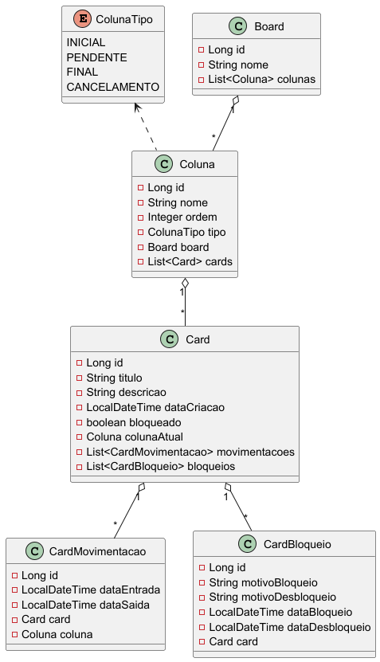
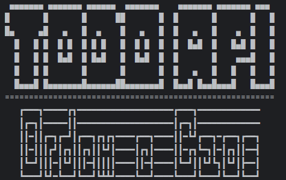
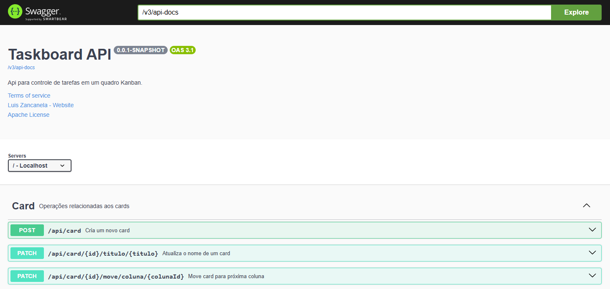
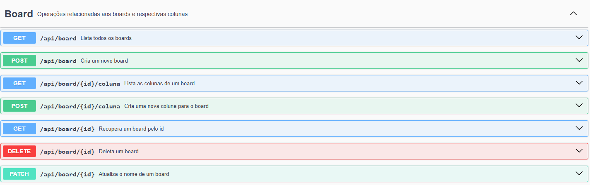
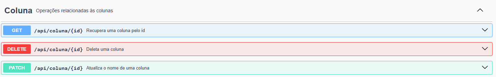
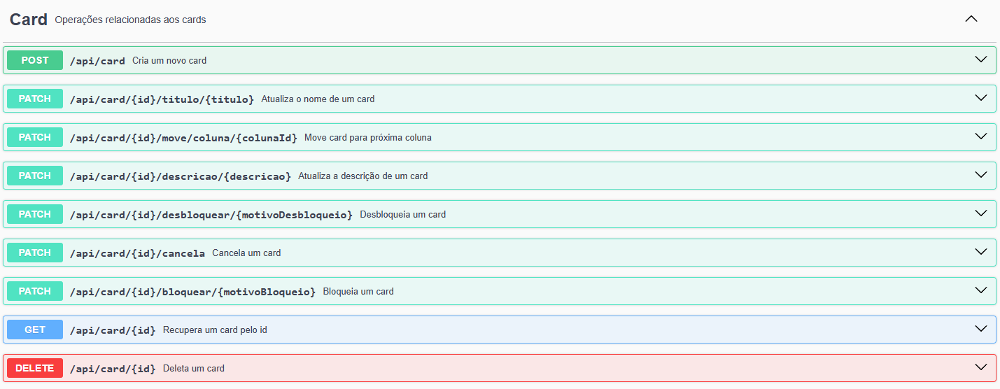
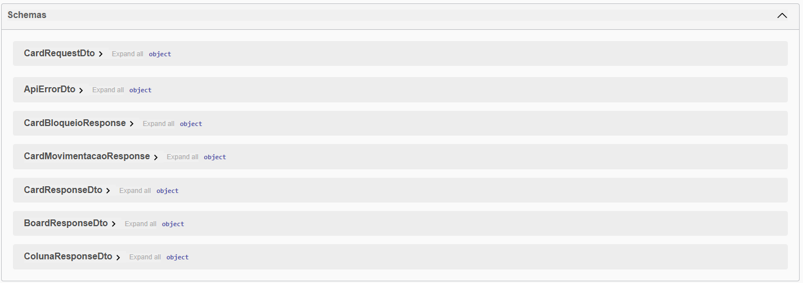

# Tōdō API: Ordem e Caos

## 🎯 Objetivo

O objetivo deste projeto é desenvolver uma API RESTful para gerenciar um board de tarefas, permitindo a criação, 
manipulação e exclusão de boards e cards. A API deve seguir as regras estabelecidas no desafio proposto, 
garantindo que os cards possam ser movidos entre colunas de acordo com as regras definidas.

*Esse projeto foi criado com base no desafio de projeto "Criando seu Board de Tarefas com Java" do bootcamp
[TONNIE - Java and AI in Europe] na [DIO]*

## 🛠️ Tecnologias Utilizadas
- Java 21
- Spring Boot 3.5.3 
- Liquidbase (para versionamento do banco de dados)
- PostgreSQL (para persistência de dados)
- Lombok (para redução de boilerplate code)
- SpringDoc (para documentação da API)

### 🚀 Desafio
Descrição base e completa do Desafio: [Desafio Taskboard Java]

#### 📋 Requisitos

##### Desafio Taskboard Java
Escreva um código que irá criar um board customizável para acompanhamento de tarefas
1. O código deve iniciar disponibilizando um menu com as seguintes opções: Criar novo board, Selecionar board, Excluir boards, Sair;
2. O código deve salvar o board com suas informações no banco de dados MySQL;

##### Regras dos boards
1. Um board deve ter um nome e ser composto por pelo menos 3 colunas ( coluna onde o card é colocado inicialmente, coluna para cards com tarefas concluídas e coluna para cards cancelados, a nomenclatura das colunas é de escolha livre);
2. As colunas tem seu respectivo nome, ordem que aparece no board e seu tipo (Inicial, cancelamento, final e pendente);
3. Cada board só pode ter 1 coluna do tipo inicial, cancelamento e final, colunas do tipo pendente podem ter quantas forem necessárias, obrigatoriamente a coluna inicial deve ser a primeira coluna do board, a final deve ser a penúltima e a de cancelamento deve ser a última
4. As colunas podem ter 0 ou N cards, cada card tem o seu título, descrição, data de criação e se está bloqueado;
5. Um card deve navegar nas colunas seguindo a ordem delas no board, sem pular nenhuma etapa, exceto pela coluna de cards cancelados que pode receber cards diretamente de qualquer coluna que não for a coluna final;
6. Se um card estiver marcado como bloqueado ele não pode ser movido até ser desbloqueado
7. Para bloquear um card deve-se informar o motivo de seu bloqueio e para desbloquea-lo deve-se também informar o motivo

##### Menu de manipulação de board selecionado
1. O menu deve permitir mover o card para próxima coluna, cancelar um card, criar um card, bloquea-lo, desbloquea-lo e fechar board;

##### Requisitos opcionais
1. Um card deve armazenar a data e hora em que foi colocado em uma coluna e a data e hora que foi movido pra a próxima coluna;
2. O código deve gerar um relatório do board selecionado com o tempo que cada tarefa demorou para ser concluída com informações do tempo que levou em cada coluna
3. O código dever gerar um relatório do board selecionado com o os bloqueios dos cards, com o tempo que ficaram bloqueados e com a justificativa dos bloqueios e desbloqueios.

## 🖼️ Visuais

### 📐 Diagrama de Classes
  
O diagrama de classes acima representa a estrutura do projeto, incluindo as principais classes e suas relações.
Ele foi gerado utilizando o plugin do IntelliJ IDEA "PlantUML Integration" e o arquivo `class-diagram.puml` localizado na pasta `docs/diagrams`.

### Spring Banner

Banner personalizado do Spring Boot que é exibido no console ao iniciar a aplicação.

### Swagger UI

A documentação da API é gerada automaticamente pelo SpringDoc e pode ser acessada através do Swagger UI,
facilitando a visualização e testes das rotas disponíveis.

#### Endpoints Board

Endpoints disponíveis para manipulação dos boards.

#### Endpoints Coluna

Endpoints disponíveis para manipulação das colunas.

#### Endpoints Card

Endpoints disponíveis para manipulação dos cards.

#### Schemas

Schemas disponíveis na API, incluindo os modelos de Board, Coluna, Card e erro.

## ▶️ Como Executar o Projeto

1. **Clone o repositório:**
   ```sh
   git clone <URL_DO_REPOSITORIO>
   cd <nome-do-projeto>
   ```

2. **Configure o banco de dados PostgreSQL**
   Execute o comando para criar container Docker do PostgreSQL:
   ```sh
    docker run --name postgres-taskboard -e POSTGRES_USER=taskboard -e POSTGRES_PASSWORD=taskboard -e POSTGRES_DB=taskboard -p 5432:5432 -d postgres
    ```
   ou execute o `docker-compose`:
   ```sh
    docker-compose up -d
    ```
   
   Certifique-se de que o banco está rodando e as variáveis de ambiente estão corretas no `application.properties`.

3. **Instale as dependências:**
   Certifique-se de ter o Maven instalado e execute o seguinte comando para instalar as dependências do projeto:
   ```sh
   ./mvnw clean install
   ```
   ou, no Windows:
   ```sh
   mvnw clean install
   ```
 
5. **Inicie a aplicação:**
   Após instalar as dependências e configurar o banco de dados, você pode iniciar a aplicação Spring Boot. Execute o seguinte comando:
   ```sh
   ./mvnw spring-boot:run
   ```
   ou, no Windows:
   ```sh
   mvnw spring-boot:run
   ```
   
6. **Acesse a API:**
   Após iniciar a aplicação, você pode acessar a API através do seguinte endereço:
   ```
   http://localhost:8080
   ```

### Documentação da API
A documentação da API está disponível através do SpringDoc. Você pode acessá-la em:
```
http://localhost:8080/swagger-ui.html
```

---
Criado com apoio do GitHub Copilot 🤖, paixão ❤️, dedicação 💪 e o compromisso sincero de aprender 📚 e compartilhar conhecimento 🌍


[DIO]: https://www.dio.me/sign-up?ref=WQ0TRWQ8E1
[TONNIE - Java and AI in Europe]: https://www.dio.me/bootcamp/tonnie-java-and-ai-europe?ref=WQ0TRWQ8E1
[Desafio Taskboard Java]: https://github.com/digitalinnovationone/exercicios-java-basico/blob/main/projetos/4%20-%20T%C3%A9cnicas%20Avan%C3%A7adas%2C%20Padr%C3%B5es%20e%20Persist%C3%AAncia%20(Literalmente).md